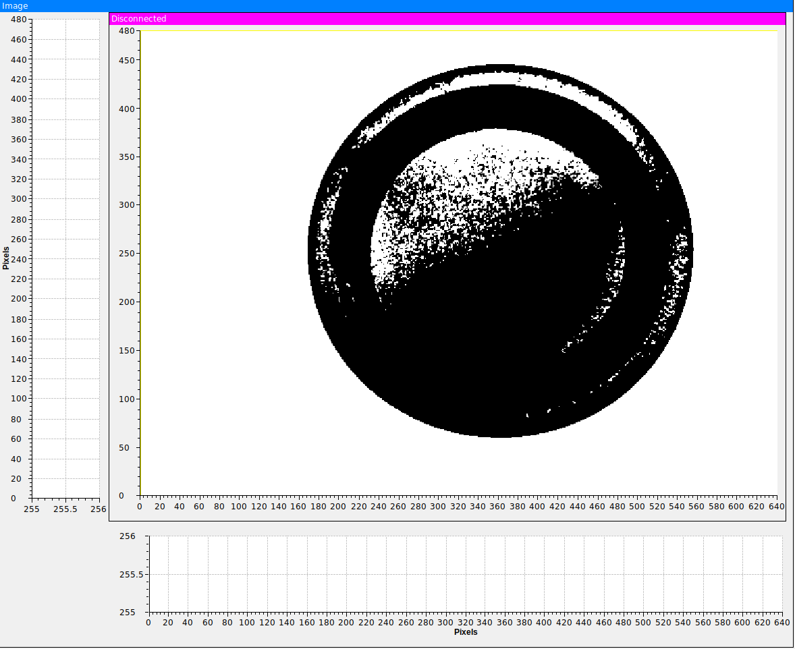
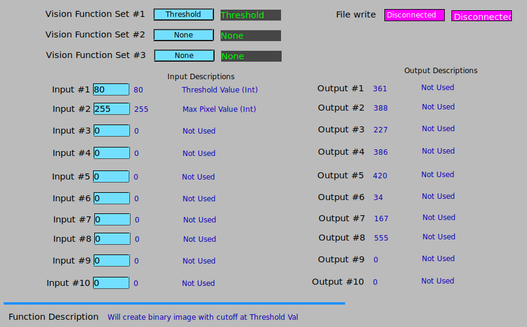
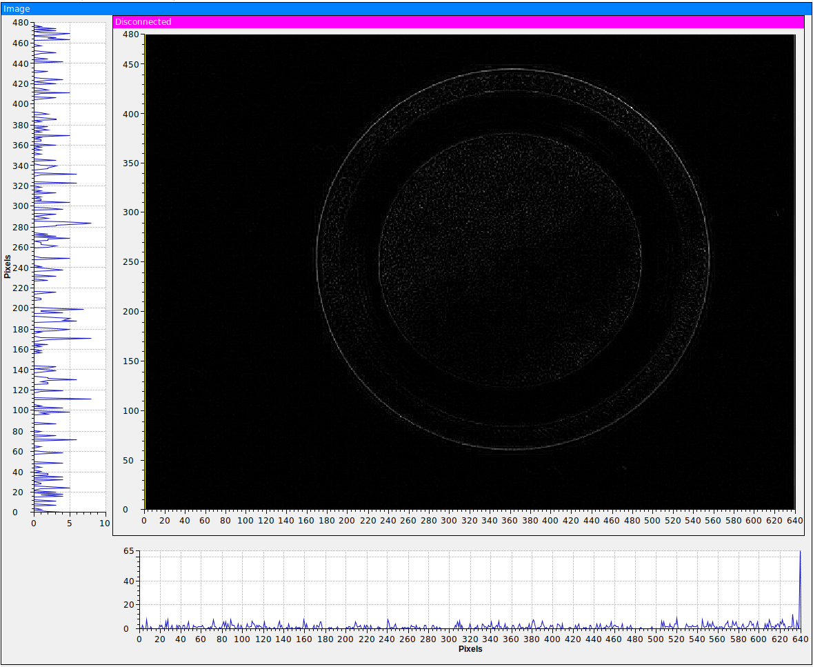
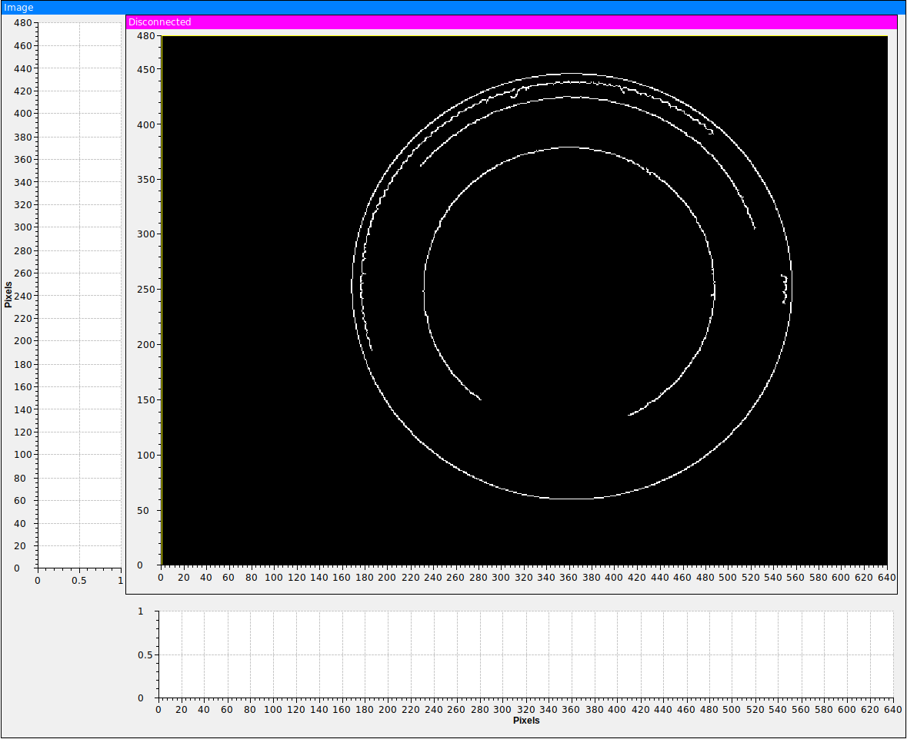
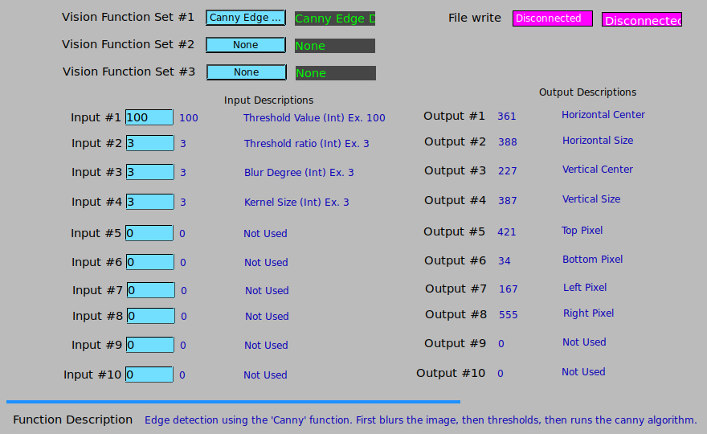
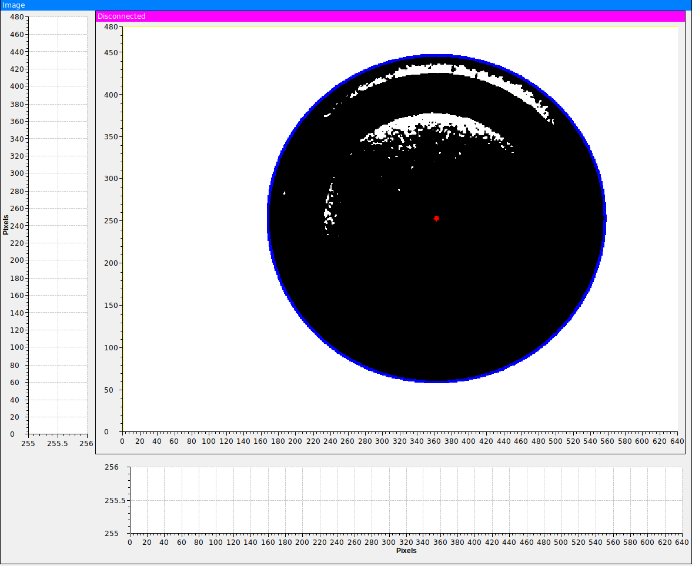
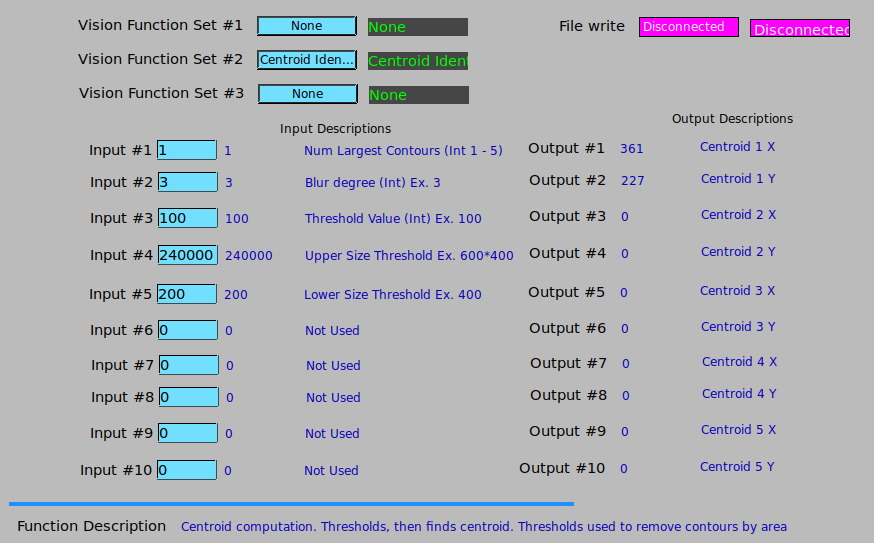

ADCompVision Documentation
==========================

Author: Jakub Wlodek
~~~~~~~~~~~~~~~~~~~~

Corresponding Author: Kazimierz Gofron
~~~~~~~~~~~~~~~~~~~~~~~~~~~~~~~~~~~~~~

Installing the plugin
~~~~~~~~~~~~~~~~~~~~~

The ADCompVision plugin depends on several external libraries. These
include:

-  Opencv: Can be built from source from
   `github <https://github.com/opencv/opencv>`__. Otherwise install from
   package manager.
-  EPICS, Area Detector, and their submodules, all of whuch can be found
   on github.

Further installation instructions are located in the README.md file in
the top level of
`this <https://github.com/epicsNSLS2-areaDetector/ADCompVision>`__
repository.

--------------

Using ADCompVision
~~~~~~~~~~~~~~~~~~

This plugin allows for a multitude of Open Computer Vision functions. As
a result, each function will use the input/output PVs differently.

To view how each function uses the inputs and outputs view the manual
`here. <ADCompVisionManual.html>`__

The main CSS screen for the ADCompVision plugin looks as follows:

|main|

To use the plugin, you must select one of the functions from the three
function sets. The other 2 function sets must be set to 'None' Then,
make sure that the image1 plugin has its input port set to be the output
port of ADCompVision (CV1). Then, open the main screen, and note that
input and output descriptions are listed for each function. Enter valid
input values for each of the required inputs. Next, start image
acquisition and enable the plugin. You should see the processed image in
image1 ArrayData. Some examples are shown below:

--------------

Release Notes
^^^^^^^^^^^^^

R1-1 (17-April-2019)
^^^^^^^^^^^^^^^^^^^^

-  Computer Vision functions implemented:

   -  Sharpening filter
   -  Image subtraction
   -  Image statistics
   -  Distance between objects

-  Additional Feature changes

   -  File saving temporarily removed due to crashing issues over ssh
      and additional dependency
   -  Camera bit depth selector added to play better with higher bit
      images
   -  Image scaling corrected to account for other bit depth images
   -  Minor screen updates to reflect feature changes

-  Bugs Fixed

   -  Bug where invalid bit depth could cause IOC to crash
   -  Bug where certain PV would cause error at IOC startup
   -  Fixed Image passthrough to work with any bit depth
   -  Fixed colorspace of color images passed through
   -  Removed code that caused certain compiler warnings - Cleaner
      compile

R1-0 (14-January-2019)
^^^^^^^^^^^^^^^^^^^^^^

-  Computer Vision functions implemented:

   -  Gaussian Blur
   -  Thresholding
   -  Laplacian Edge Detection
   -  Canny Edge Detection
   -  Centroid Detection
   -  User Definable Function

-  Additional Features added

   -  Processed image file saving. (This can work in tandem with
      NDPluginFile)
   -  Support for mono or RGB images
   -  Support for 8, 16, 32, and 64 bit images
   -  Flexible and modular function implementation system
   -  CSS User Interface screen
   -  Documentation

-  Known Limitations:

   -  No current support for performing operations accross multiple
      images. Required for several CV functions
   -  Conversion between PV and ADCV\_Function is convoluted and should
      be reworked

-  Future Release Plans

   -  Expand list of supported functions

      -  Motion Vectors
      -  Object identification
      -  Image alignment
      -  More...

   -  Perform tests with variety of cameras
   -  Performance improvements and bug fixes
   -  Expand file saving to allow for capture, stream, etc

--------------

Usage Examples:
^^^^^^^^^^^^^^^

Thresholding

|Thresholding| |Thresholding Menu|

Laplacian Edge Detection

|Laplacian| |Laplacian Menu|

Canny edge detection

|Canny| |Canny Menu|

Centroid identification

|Centroid| |Centroid Menu|

--------------

Issues and Pull Requests
^^^^^^^^^^^^^^^^^^^^^^^^

If you wish to create an issue or pull request, please do so at the
source fork on `github. <https://github.com/jwlodek/ADCompVision>`__

--------------

Important Links
^^^^^^^^^^^^^^^

| `Area Detector on Github <https://github.com/areaDetector>`__
| `NSLS2 area detector reposiotries on
  Github <https://github.com/epicsNSLS2-areaDetector>`__
| `ADCompVision on
  Github <https://github.com/epicsNSLS2-areaDetector/ADCompVision>`__

--------------

copyright: Brookhaven National Laboratory 2018-2019
~~~~~~~~~~~~~~~~~~~~~~~~~~~~~~~~~~~~~~~~~~~~~~~~~~~

.. |main| image:: MainCVScreen.png

.. |Laplacian Menu| image:: laplacian_menu.png

